# 🗓️ Taller Práctico: Fechas e Intervalos en PostgreSQL

## Sistema de Reservas de Hotel

Este proyecto contiene la solución completa de un **taller práctico de bases de datos** enfocado en el manejo de **fechas, timestamps e intervalos en PostgreSQL**, aplicado a un sistema de reservas hoteleras.

---

## 📁 Estructura del Proyecto

```
casos de uso/
├── .devcontainer/
│   ├── Dockerfile             ← Imagen del workspace (cliente psql)
│   └── devcontainer.json      ← Configuración para VS Code
├── init/
│   ├── 01_database.sql        ← DDL auto-ejecutado por Docker al iniciar
│   └── 02_datos_prueba.sql    ← DML auto-ejecutado por Docker al iniciar
├── .env                       ← Variables de entorno (credenciales)
├── docker-compose.yml         ← Orquestación de servicios Docker
├── README.md                  ← Este archivo (instrucciones)
├── database.sql               ← Estructura de la base de datos (DDL)
├── datos_prueba.sql           ← Datos de prueba (DML - INSERT)
├── consultas.sql              ← 35 consultas + reto integrador + reporte gerencial
└── taller_explicado.md        ← Explicación analítica de cada caso de uso
```

| Archivo | Contenido |
|---------|-----------|
| `database.sql` | Creación de la tabla `reservas` con todos sus campos, tipos de dato y restricciones (`CHECK`, `PRIMARY KEY`) |
| `datos_prueba.sql` | 20 registros `INSERT INTO` con datos variados: distintos estados, tipos de habitación y fechas distribuidas entre marzo y octubre 2026 |
| `consultas.sql` | Las 35 consultas resueltas (comentadas por caso), el reto integrador y las 4 secciones del reporte gerencial |
| `taller_explicado.md` | Explicación paso a paso de la lógica detrás de cada consulta (sin DDL ni DML, solo parte analítica) |
| `init/` | Scripts SQL numerados que Docker ejecuta automáticamente al crear el contenedor por primera vez |
| `.env` | Credenciales de PostgreSQL y pgAdmin |
| `docker-compose.yml` | Define los servicios: PostgreSQL 16, pgAdmin 4 y workspace de desarrollo |

---

## 🧰 Requisitos Previos

### Opción A: Con Docker (recomendado)
- [Docker Desktop](https://www.docker.com/products/docker-desktop/) instalado y corriendo

### Opción B: Sin Docker (instalación local)
- **PostgreSQL** instalado (versión 12 o superior recomendada)
- Una herramienta de administración de bases de datos:
  - [pgAdmin 4](https://www.pgadmin.org/) (interfaz gráfica oficial)
  - [DBeaver](https://dbeaver.io/) (alternativa multiplataforma)
  - O cualquier cliente SQL compatible con PostgreSQL

---

## 🐳 Opción A: Guía con Docker

### Paso 1: Levantar los contenedores

Abre una terminal en la carpeta del proyecto y ejecuta:

```bash
docker compose up -d
```

Esto levanta 3 servicios:

| Servicio | Puerto | Descripción |
|----------|--------|-------------|
| `postgres_db` | `5433` | Servidor PostgreSQL 16 |
| `pgadmin_web` | `8081` | Interfaz web pgAdmin 4 |
| `workspace` | — | Contenedor de desarrollo con `psql` |

> 💡 **La tabla `reservas` y los 20 registros de prueba se crean automáticamente** gracias a los scripts en la carpeta `init/`. No necesitas ejecutar `database.sql` ni `datos_prueba.sql` manualmente.

---

### Paso 2: Acceder a pgAdmin

1. Abre tu navegador en: **http://localhost:8081**
2. Inicia sesión con las credenciales del `.env`:
   - **Email:** `danielosoriog2008@gmail.com`
   - **Password:** `Santiago0724.`

---

### Paso 3: Registrar el servidor en pgAdmin

1. Click derecho en **Servers** → **Register** → **Server...**
2. Pestaña **General**:
   - **Name:** `Taller Fechas`
3. Pestaña **Connection**:
   - **Host name:** `postgres_db` (nombre del servicio en Docker, NO `localhost`)
   - **Port:** `5432` (puerto interno del contenedor)
   - **Maintenance database:** `bkddb`
   - **Username:** `bkseducate`
   - **Password:** `bkseducate2026`
   - ✅ Marcar **Save password**
4. Click en **Save**

---

### Paso 4: Ejecutar las consultas

1. En pgAdmin, navega a: **Servers → Taller Fechas → Databases → bkddb**
2. Click derecho en **bkddb** → **Query Tool**
3. Abre el archivo **`consultas.sql`** o copia y pega las consultas una por una
4. Lee la explicación de cada caso en **`taller_explicado.md`** en paralelo

> 💡 **Tip:** Selecciona solo la consulta que quieres ejecutar y presiona **F5** para ejecutar solo la selección.

---

### Paso 5: Reiniciar los datos (si es necesario)

Si necesitas volver al estado original después de ejecutar los UPDATE (casos 33-35):

```bash
# Detener y eliminar contenedores + volúmenes
docker compose down -v

# Volver a levantar (recrea todo desde cero)
docker compose up -d
```

> El flag `-v` elimina los volúmenes de datos, forzando a Docker a re-ejecutar los scripts de `init/`.

---

## 🖥️ Opción B: Guía sin Docker (Instalación Local)

### Paso 1: Crear la base de datos

Abre tu herramienta de administración y crea una nueva base de datos para el taller:

```sql
CREATE DATABASE taller_fechas;
```

Luego conéctate a esa base de datos.

---

### Paso 2: Ejecutar `database.sql` (estructura)

1. Abre el archivo **`database.sql`** en tu herramienta (pgAdmin, DBeaver, etc.)
2. Ejecuta todo el contenido del archivo (F5 en pgAdmin o Ctrl+Enter en DBeaver)
3. Esto creará la tabla `reservas` con todos sus campos y restricciones

> 💡 **Tip:** Si necesitas empezar de cero en cualquier momento, vuelve a ejecutar este archivo. El `DROP TABLE IF EXISTS` al inicio eliminará la tabla anterior.

---

### Paso 3: Ejecutar `datos_prueba.sql` (datos de prueba)

1. Abre el archivo **`datos_prueba.sql`**
2. Ejecuta todo el contenido del archivo
3. Esto insertará los 20 registros de prueba necesarios para que todas las consultas funcionen

4. Verifica que los datos se insertaron correctamente:
   ```sql
   SELECT * FROM reservas;
   ```
   Deberías ver 20 registros.

---

### Paso 4: Probar las consultas caso por caso con `consultas.sql`

1. Abre el archivo **`taller_explicado.md`** para leer la explicación de cada caso de uso
2. En paralelo, abre **`consultas.sql`** en tu herramienta SQL
3. Cada consulta está identificada con un comentario:
   ```sql
   -- ============================================================
   -- Caso de uso X: Título del caso
   -- ============================================================
   ```

4. **Flujo recomendado:**
   - Lee la explicación del caso en `taller_explicado.md`
   - Selecciona y ejecuta la consulta correspondiente en `consultas.sql`
   - Observa los resultados
   - Pasa al siguiente caso

> 💡 **Tip en pgAdmin:** Selecciona solo las líneas de la consulta que quieres ejecutar y presiona **F5** o el botón ▶ para ejecutar solo la selección.
>
> 💡 **Tip en DBeaver:** Selecciona el texto deseado y presiona **Ctrl + Enter** para ejecutar solo la selección.

---

### Paso 5: Ejecutar el Reto Integrador y el Reporte Gerencial

Estos se encuentran al final del archivo `consultas.sql`. Son consultas más complejas que combinan múltiples funciones:

- **Reto Integrador:** Una sola consulta que genera un resumen ejecutivo por tipo de habitación
- **Reporte Gerencial:** 4 secciones con CTEs, funciones de ventana y alertas operativas

> ⚠️ **Nota:** El reporte gerencial tiene 4 secciones independientes. Ejecuta cada `SELECT` por separado para ver los resultados de cada sección.

---

## ⚠️ Nota Importante: Evidencias para los UPDATE (Casos 33, 34 y 35)

Los casos de uso 33, 34 y 35 involucran sentencias `UPDATE` que **modifican datos** en la tabla. Para tomar correctamente las evidencias:

### Procedimiento para cada UPDATE:

```
1️⃣  Ejecutar el SELECT "ANTES" → Tomar captura de pantalla
2️⃣  Ejecutar el UPDATE → Verificar que dice "UPDATE X" (filas afectadas)
3️⃣  Ejecutar el SELECT "DESPUÉS" → Tomar captura de pantalla
```

### Detalle por caso:

| Caso | Qué hace el UPDATE | Qué observar en las evidencias |
|------|-------------------|-------------------------------|
| **33** | Extiende el checkout de la reserva #14 sumando 2 días | La columna `fecha_checkout` debe mostrar 2 días más en el "después" |
| **34** | Cancela reservas con más de 90 días de antigüedad | La columna `estado` debe cambiar a `'cancelada'` en el "después" |
| **35** | Incrementa la tarifa en 15% para suites | La columna `tarifa_noche` debe ser 1.15x mayor en el "después" |

> 🔴 **¡IMPORTANTE!** Los UPDATE son **irreversibles** (a menos que estés dentro de una transacción).
>
> - **Con Docker:** Ejecuta `docker compose down -v` y luego `docker compose up -d` para reiniciar todo.
> - **Sin Docker:** Ejecuta nuevamente `database.sql` y luego `datos_prueba.sql` para recrear la tabla.

> 💡 **Tip profesional:** Puedes usar transacciones para proteger tus datos:
> ```sql
> BEGIN;          -- Inicia la transacción
> -- Ejecuta el SELECT antes
> -- Ejecuta el UPDATE
> -- Ejecuta el SELECT después
> COMMIT;         -- Confirma los cambios (o ROLLBACK para deshacer)
> ```

---

## 📋 Contenido del Taller

### 35 Casos de Uso

| # | Tema | Función principal |
|---|------|-------------------|
| 1 | Fecha y hora actual del servidor | `CURRENT_TIMESTAMP` |
| 2 | Extraer año de la fecha de reserva | `EXTRACT(YEAR)` |
| 3 | Extraer mes del check-in | `EXTRACT(MONTH)` |
| 4 | Extraer día del checkout | `EXTRACT(DAY)` |
| 5 | Día de la semana de la reserva | `EXTRACT(DOW)`, `TO_CHAR` |
| 6 | Hora de la reserva | `EXTRACT(HOUR)` |
| 7 | Cantidad de noches de estadía | `::DATE`, resta de fechas |
| 8 | Reservas de un año específico | `EXTRACT(YEAR) = 2026` |
| 9 | Reservas con check-in en septiembre | `EXTRACT(MONTH) = 9` |
| 10 | Reservas de los últimos 30 días | `INTERVAL '30 days'` |
| 11 | Check-in en los próximos 7 días | `BETWEEN`, `INTERVAL` |
| 12 | Sumar 5 días al checkout | `+ INTERVAL '5 days'` |
| 13 | Restar 3 horas al check-in | `- INTERVAL '3 hours'` |
| 14 | Antigüedad de la reserva | `AGE()` |
| 15 | Estadías mayores a 5 noches | Resta de fechas + `WHERE` |
| 16 | Formato DD/MM/YYYY | `TO_CHAR(fecha, 'DD/MM/YYYY')` |
| 17 | Nombre del mes del check-in | `TO_CHAR(fecha, 'TMMonth')` |
| 18 | Nombre del día del check-in | `TO_CHAR(fecha, 'TMDay')` |
| 19 | Reservas de fin de semana | `EXTRACT(DOW) IN (0, 6)` |
| 20 | Checkout ya pasó | `< CURRENT_TIMESTAMP` |
| 21 | Check-in aún no llega | `> CURRENT_TIMESTAMP` |
| 22 | Ingreso total por reserva | Tarifa × noches |
| 23 | Truncar fecha al mes | `DATE_TRUNC('month')` |
| 24 | Horas entre reserva y check-in | `EXTRACT(EPOCH) / 3600` |
| 25 | Check-in y checkout en el mismo mes | Doble `EXTRACT` |
| 26 | Estadías de exactamente 7 días | Resta `= 7` |
| 27 | Orden por proximidad al check-in | `ABS()`, `EPOCH` |
| 28 | Promedio de noches por tipo | `AVG()`, `GROUP BY` |
| 29 | Agrupación por trimestre | `EXTRACT(QUARTER)` |
| 30 | Cancelaciones recientes | `INTERVAL '2 weeks'` |
| 31 | Conteo por estado | `COUNT()`, `GROUP BY` |
| 32 | Reserva el mismo día del check-in | `::DATE = ::DATE` |
| 33 | UPDATE: Extender checkout | `+ INTERVAL '2 days'` |
| 34 | UPDATE: Cancelar antiguas (+90 días) | `AGE() > INTERVAL` |
| 35 | UPDATE: Subir tarifa 15% a suites | `ROUND(campo * 1.15, 2)` |

### Reto Integrador
Resumen ejecutivo por tipo de habitación combinando `FILTER`, `CASE`, `EXTRACT(EPOCH)`, `TO_CHAR`, y múltiples funciones de agregación.

### Caso de Uso Avanzado (Reporte Gerencial)
Reporte completo con **CTEs**, **funciones de ventana** (`RANK`, `ROW_NUMBER`, `SUM OVER`), tendencia mensual, ocupación semanal y alertas operativas.

---

## 🛠️ Funciones PostgreSQL Cubiertas

| Categoría | Funciones |
|-----------|-----------|
| **Fecha actual** | `CURRENT_TIMESTAMP`, `NOW()` |
| **Extracción** | `EXTRACT(YEAR\|MONTH\|DAY\|HOUR\|DOW\|QUARTER\|EPOCH)` |
| **Diferencia** | `AGE()`, resta de fechas, `EPOCH` |
| **Truncamiento** | `DATE_TRUNC()` |
| **Formateo** | `TO_CHAR()` con patrones `DD`, `MM`, `YYYY`, `TMMonth`, `TMDay` |
| **Intervalos** | `INTERVAL '... days\|hours\|weeks\|months'` |
| **Casting** | `::DATE`, `::NUMERIC` |
| **Agregación** | `COUNT()`, `SUM()`, `AVG()`, `MIN()`, `MAX()`, `ROUND()` |
| **Condicionales** | `CASE WHEN`, `FILTER (WHERE ...)` |
| **Ventana** | `RANK() OVER()`, `ROW_NUMBER() OVER()`, `SUM() OVER()` |

---

## 📝 Licencia

Este proyecto es material educativo de uso libre para fines académicos.

---

## 📸 Evidencias y Solución de Casos de Uso

A continuación se presentan las consultas SQL de cada caso de uso junto con su respectiva evidencia de ejecución:

### Caso de uso 1: Obtener la fecha y hora actual del servidor

```sql
SELECT CURRENT_TIMESTAMP AS fecha_hora_actual;


-- ============================================================
```

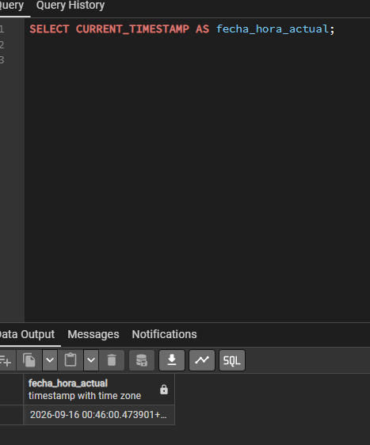

### Caso de uso 2: Extraer el año de la fecha de reserva

```sql
SELECT
    id_reserva,
    nombre_cliente,
    fecha_reserva,
    EXTRACT(YEAR FROM fecha_reserva) AS anio_reserva
FROM reservas;


-- ============================================================
```

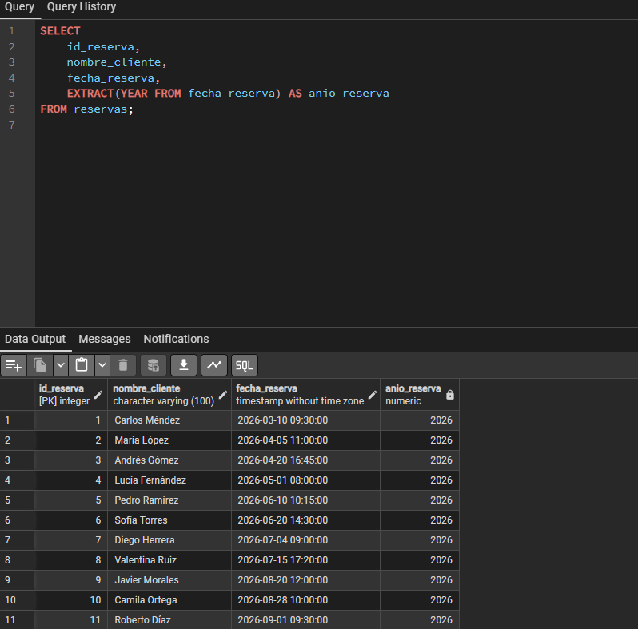

### Caso de uso 3: Extraer el mes de la fecha de check-in

```sql
SELECT
    id_reserva,
    nombre_cliente,
    fecha_checkin,
    EXTRACT(MONTH FROM fecha_checkin) AS mes_checkin
FROM reservas;


-- ============================================================
```

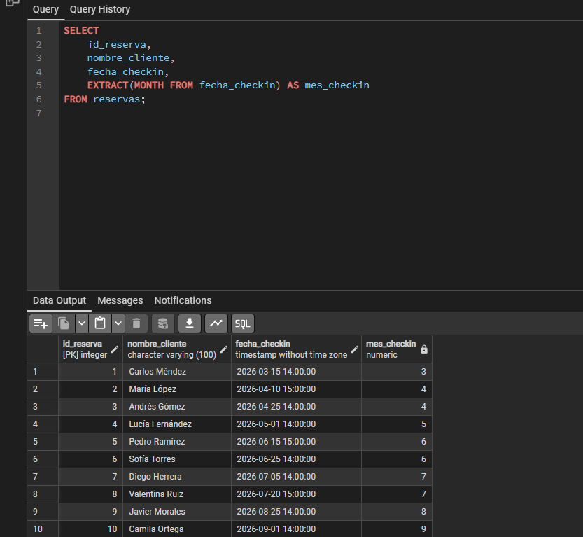

### Caso de uso 4: Extraer el día del mes de la fecha de checkout

```sql
SELECT
    id_reserva,
    nombre_cliente,
    fecha_checkout,
    EXTRACT(DAY FROM fecha_checkout) AS dia_checkout
FROM reservas;


-- ============================================================
```

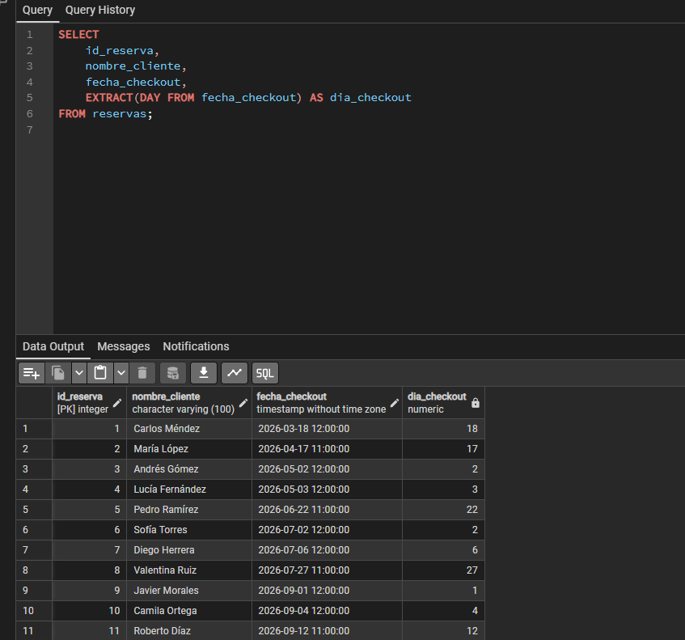

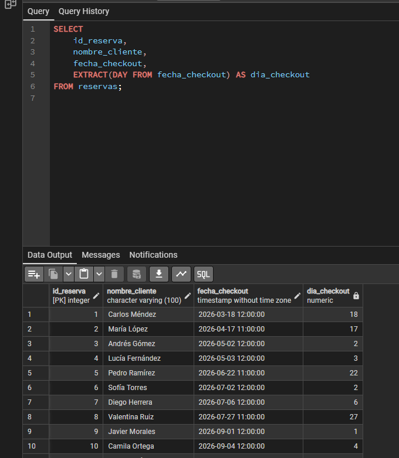

### Caso de uso 5: Extraer el día de la semana de la fecha de reserva

```sql
-- DOW = Day Of Week (0 = domingo, 1 = lunes, ..., 6 = sábado)
SELECT
    id_reserva,
    nombre_cliente,
    fecha_reserva,
    EXTRACT(DOW FROM fecha_reserva) AS dia_semana_numero,
    TO_CHAR(fecha_reserva, 'Day') AS dia_semana_nombre
FROM reservas;


-- ============================================================
```

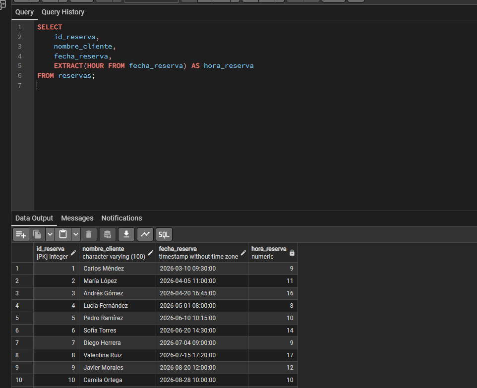

### Caso de uso 6: Extraer la hora de la fecha de reserva

```sql
SELECT
    id_reserva,
    nombre_cliente,
    fecha_reserva,
    EXTRACT(HOUR FROM fecha_reserva) AS hora_reserva
FROM reservas;


-- ============================================================
```

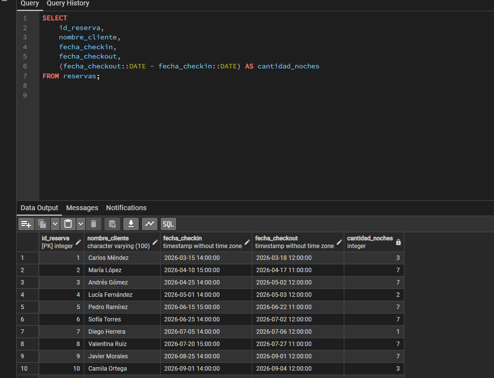

### Caso de uso 7: Calcular la cantidad de noches de estadía

```sql
SELECT
    id_reserva,
    nombre_cliente,
    fecha_checkin,
    fecha_checkout,
    (fecha_checkout::DATE - fecha_checkin::DATE) AS cantidad_noches
FROM reservas;


-- ============================================================
```

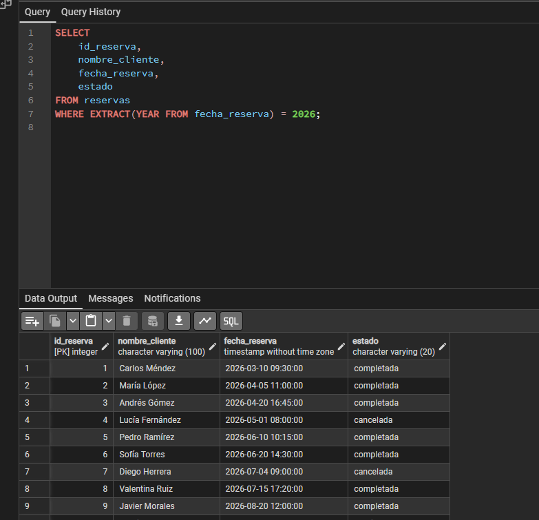

### Caso de uso 8: Filtrar reservas realizadas en un año específico (2026)

```sql
SELECT
    id_reserva,
    nombre_cliente,
    fecha_reserva,
    estado
FROM reservas
WHERE EXTRACT(YEAR FROM fecha_reserva) = 2026;


-- ============================================================
```

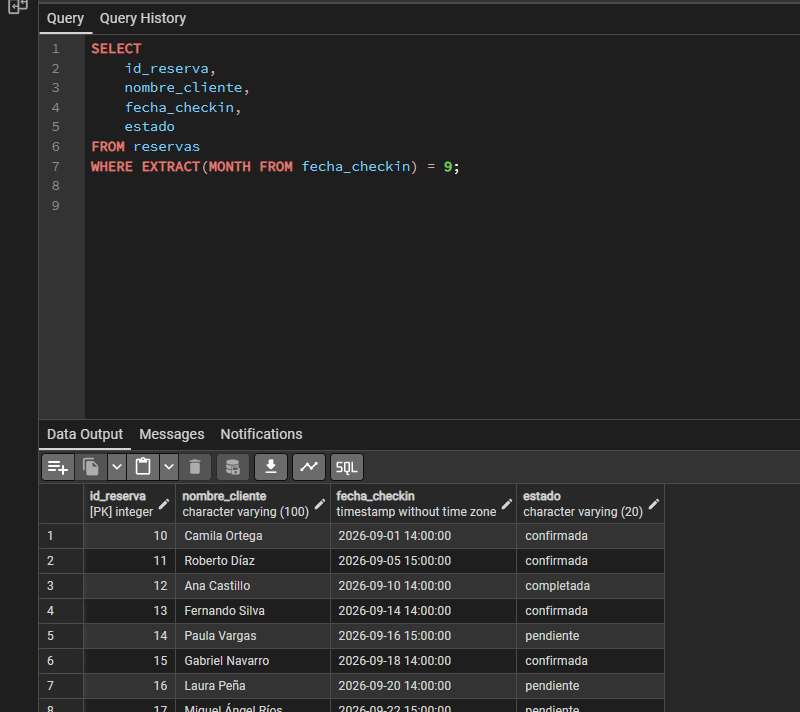

### Caso de uso 9: Filtrar reservas con check-in en un mes específico (septiembre)

```sql
SELECT
    id_reserva,
    nombre_cliente,
    fecha_checkin,
    estado
FROM reservas
WHERE EXTRACT(MONTH FROM fecha_checkin) = 9;


-- ============================================================
```

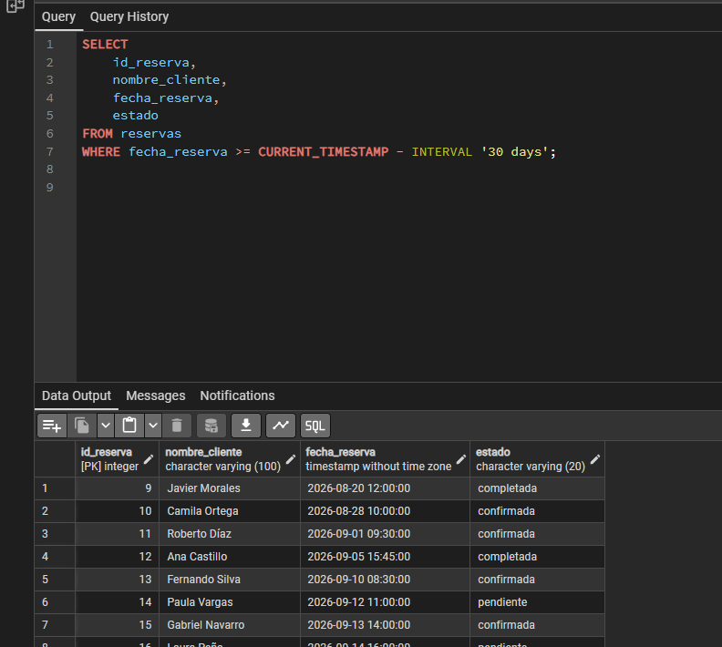

### Caso de uso 10: Reservas realizadas en los últimos 30 días

```sql
SELECT
    id_reserva,
    nombre_cliente,
    fecha_reserva,
    estado
FROM reservas
WHERE fecha_reserva >= CURRENT_TIMESTAMP - INTERVAL '30 days';


-- ============================================================
```

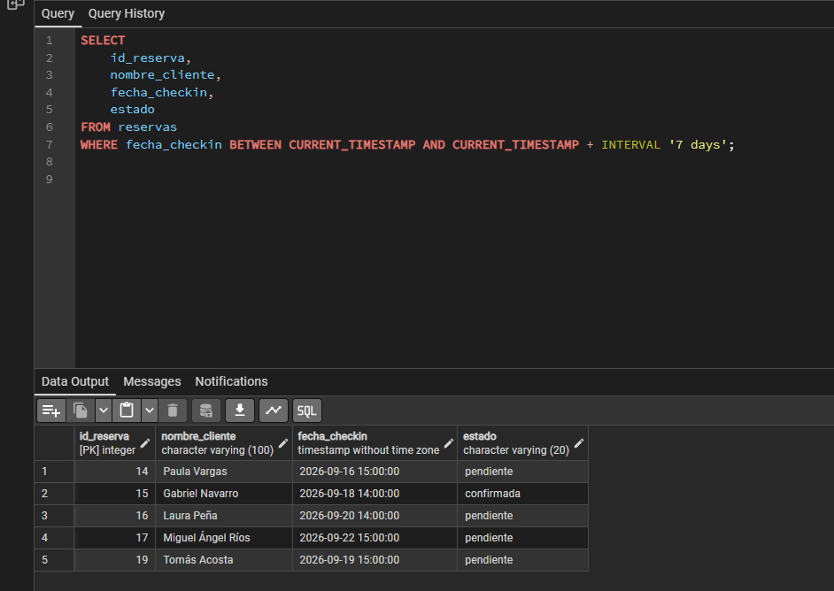

### Caso de uso 11: Reservas con check-in en los próximos 7 días

```sql
SELECT
    id_reserva,
    nombre_cliente,
    fecha_checkin,
    estado
FROM reservas
WHERE fecha_checkin BETWEEN CURRENT_TIMESTAMP AND CURRENT_TIMESTAMP + INTERVAL '7 days';


-- ============================================================
```

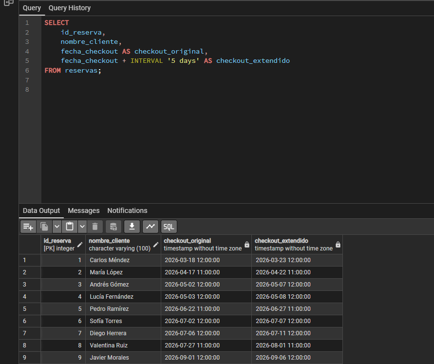

### Caso de uso 12: Sumar 5 días a la fecha de checkout

```sql
SELECT
    id_reserva,
    nombre_cliente,
    fecha_checkout AS checkout_original,
    fecha_checkout + INTERVAL '5 days' AS checkout_extendido
FROM reservas;


-- ============================================================
```

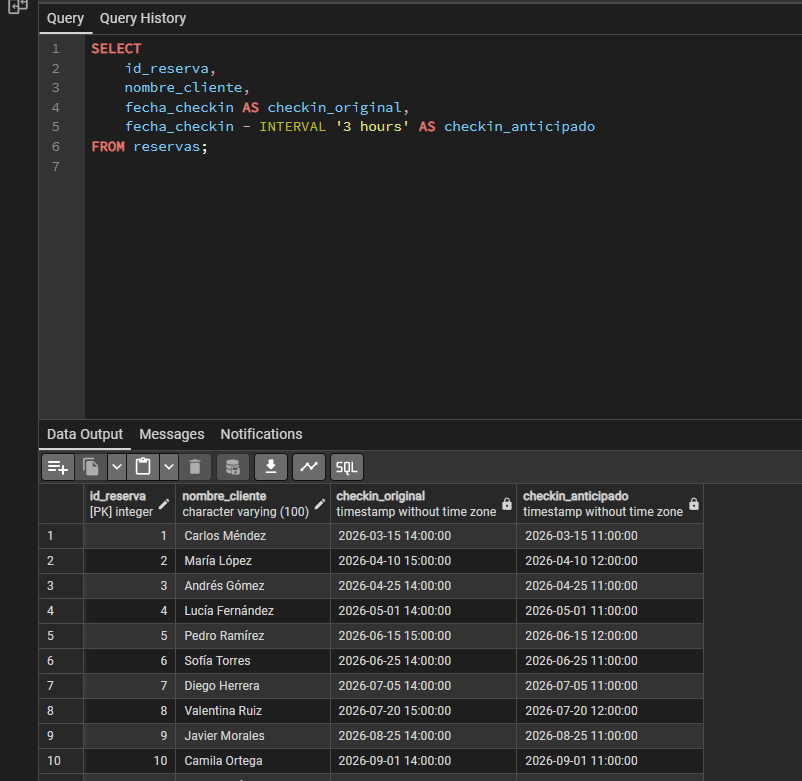

### Caso de uso 13: Restar 3 horas a la fecha de check-in

```sql
SELECT
    id_reserva,
    nombre_cliente,
    fecha_checkin AS checkin_original,
    fecha_checkin - INTERVAL '3 hours' AS checkin_anticipado
FROM reservas;


-- ============================================================
```

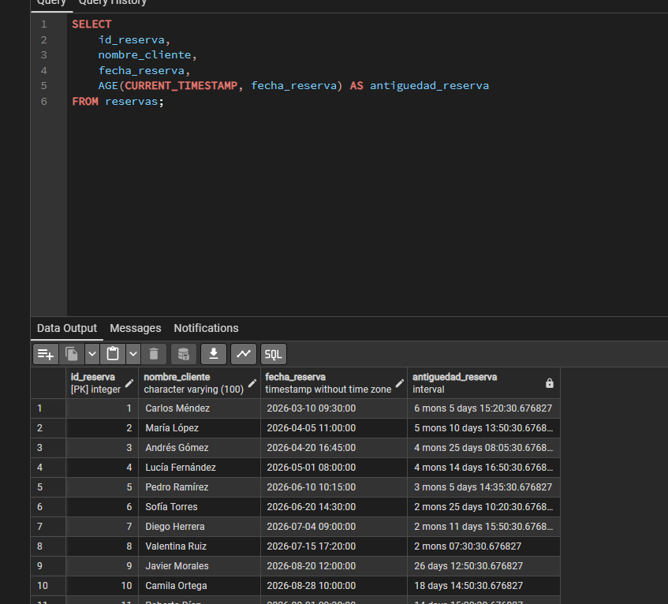

### Caso de uso 14: Calcular la antigüedad de cada reserva

```sql
SELECT
    id_reserva,
    nombre_cliente,
    fecha_reserva,
    AGE(CURRENT_TIMESTAMP, fecha_reserva) AS antiguedad_reserva
FROM reservas;


-- ============================================================
```

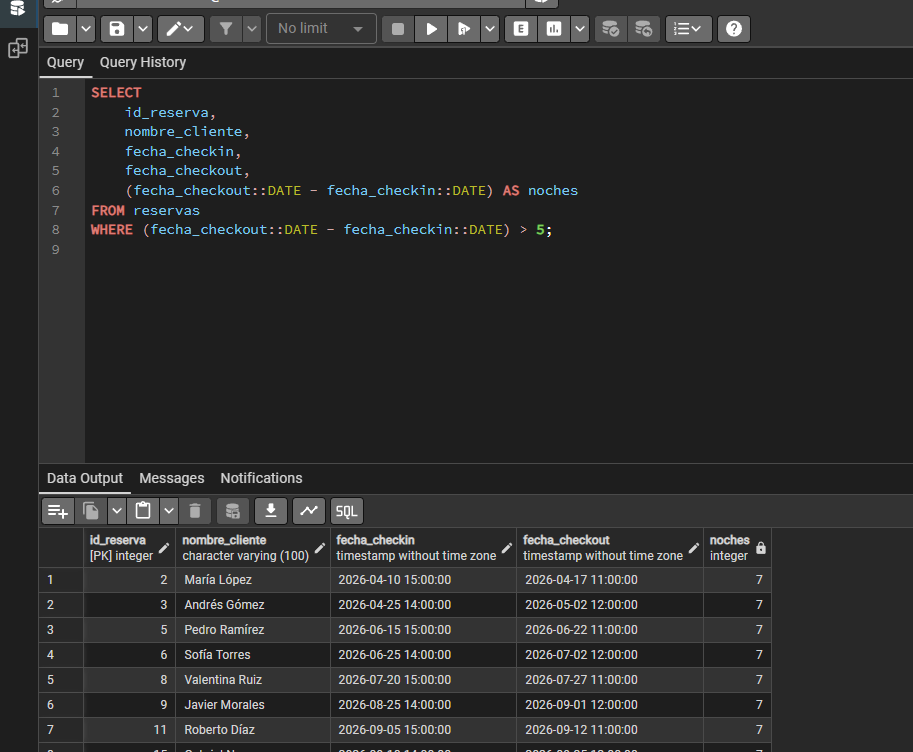

### Caso de uso 15: Reservas donde el huésped se quedó más de 5 noches

```sql
SELECT
    id_reserva,
    nombre_cliente,
    fecha_checkin,
    fecha_checkout,
    (fecha_checkout::DATE - fecha_checkin::DATE) AS noches
FROM reservas
WHERE (fecha_checkout::DATE - fecha_checkin::DATE) > 5;


-- ============================================================
```

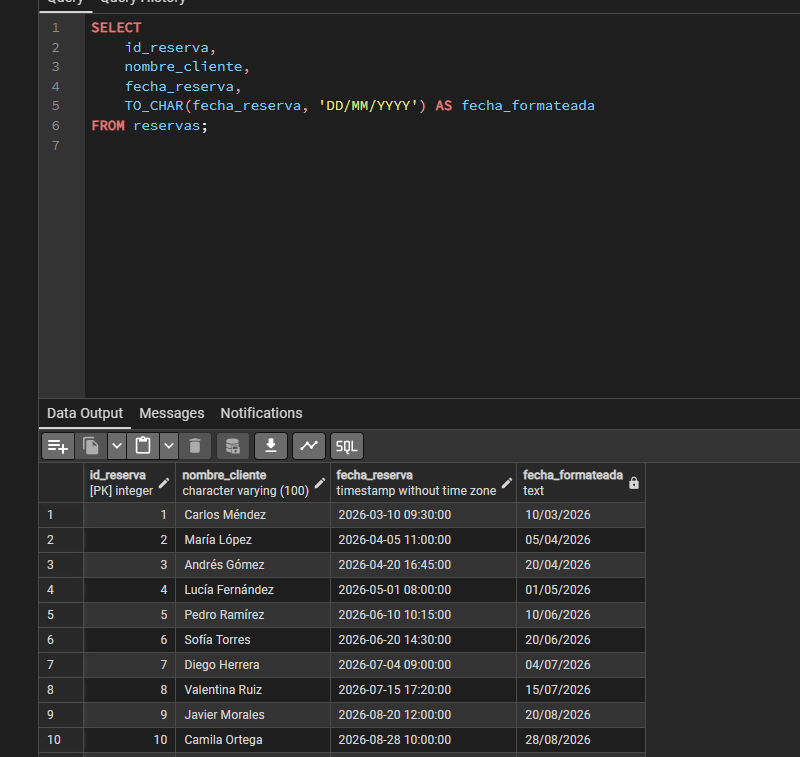

### Caso de uso 16: Formatear la fecha de reserva como 'DD/MM/YYYY'

```sql
SELECT
    id_reserva,
    nombre_cliente,
    fecha_reserva,
    TO_CHAR(fecha_reserva, 'DD/MM/YYYY') AS fecha_formateada
FROM reservas;


-- ============================================================
```

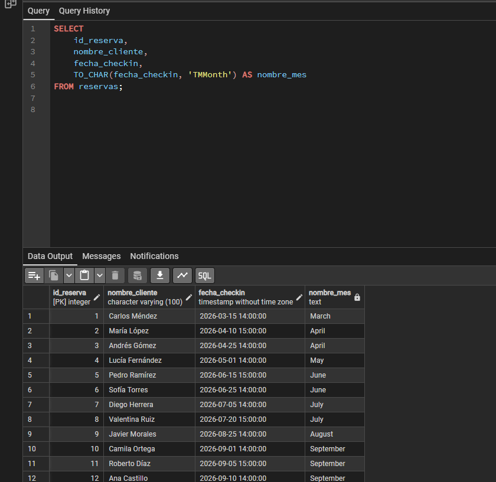

### Caso de uso 17: Obtener el nombre del mes de la fecha de check-in

```sql
SELECT
    id_reserva,
    nombre_cliente,
    fecha_checkin,
    TO_CHAR(fecha_checkin, 'TMMonth') AS nombre_mes
FROM reservas;


-- ============================================================
```

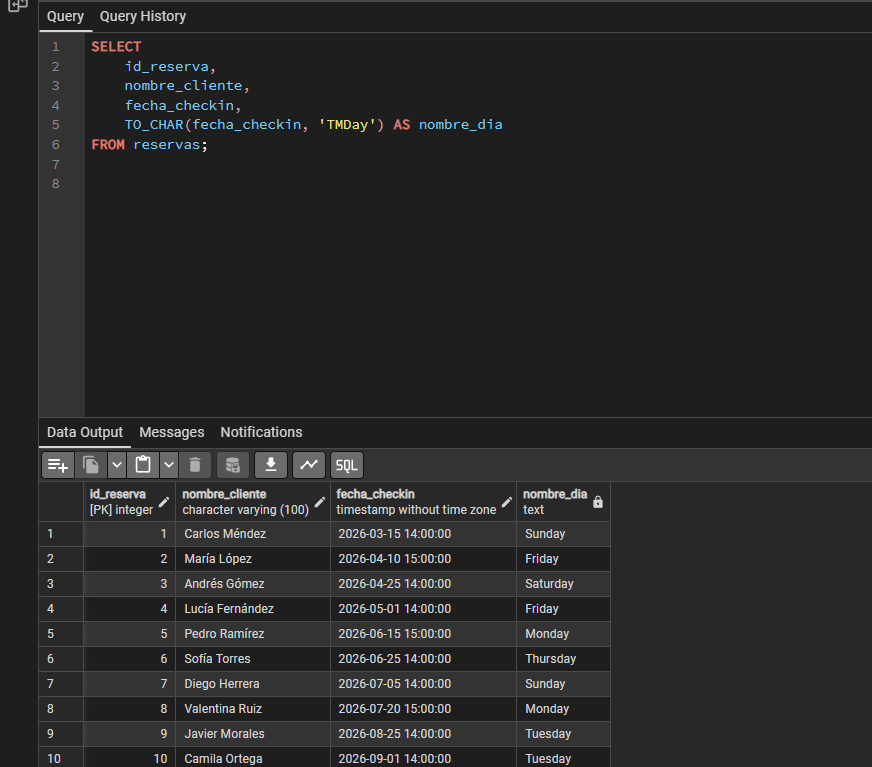

### Caso de uso 18: Obtener el nombre del día de la semana del check-in

```sql
SELECT
    id_reserva,
    nombre_cliente,
    fecha_checkin,
    TO_CHAR(fecha_checkin, 'TMDay') AS nombre_dia
FROM reservas;


-- ============================================================
```

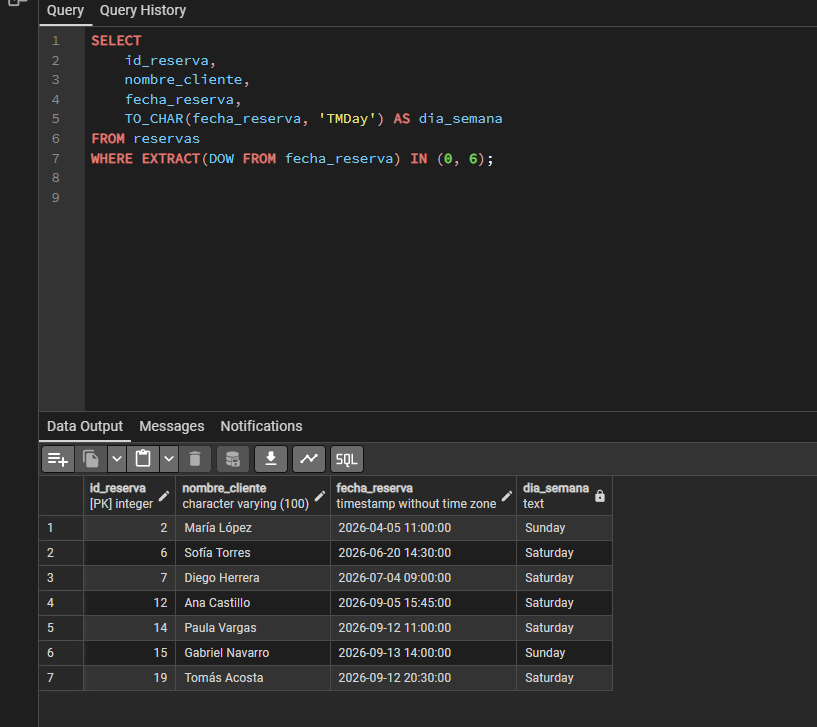

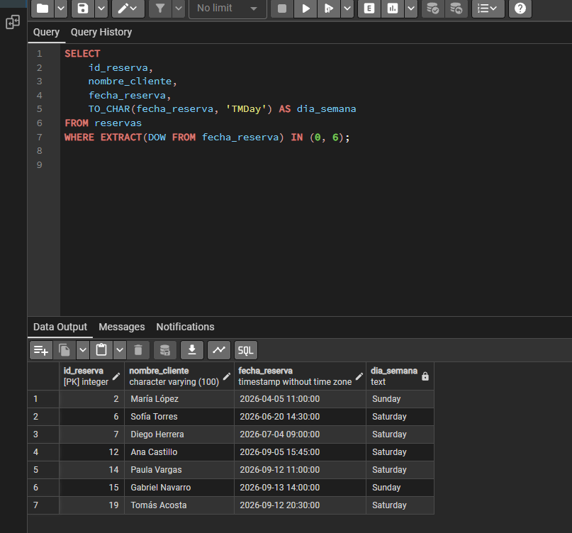

### Caso de uso 19: Reservas realizadas en fin de semana (sábado o domingo)

```sql
SELECT
    id_reserva,
    nombre_cliente,
    fecha_reserva,
    TO_CHAR(fecha_reserva, 'TMDay') AS dia_semana
FROM reservas
WHERE EXTRACT(DOW FROM fecha_reserva) IN (0, 6);


-- ============================================================
```

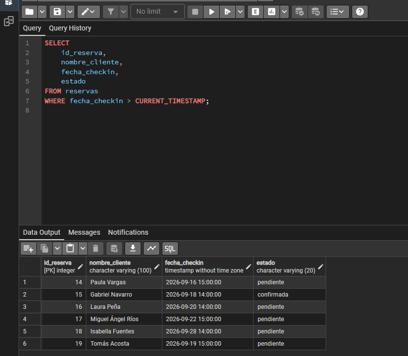

### Caso de uso 20: Reservas cuyo checkout ya pasó (huéspedes que ya se fueron)

```sql
SELECT
    id_reserva,
    nombre_cliente,
    fecha_checkout,
    estado
FROM reservas
WHERE fecha_checkout < CURRENT_TIMESTAMP;


-- ============================================================
```

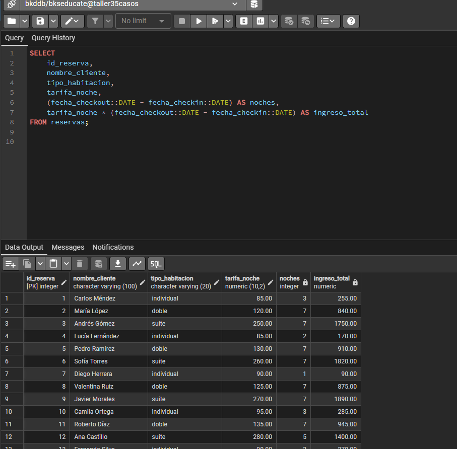

### Caso de uso 21: Reservas cuyo check-in aún no ha llegado

```sql
SELECT
    id_reserva,
    nombre_cliente,
    fecha_checkin,
    estado
FROM reservas
WHERE fecha_checkin > CURRENT_TIMESTAMP;


-- ============================================================
```

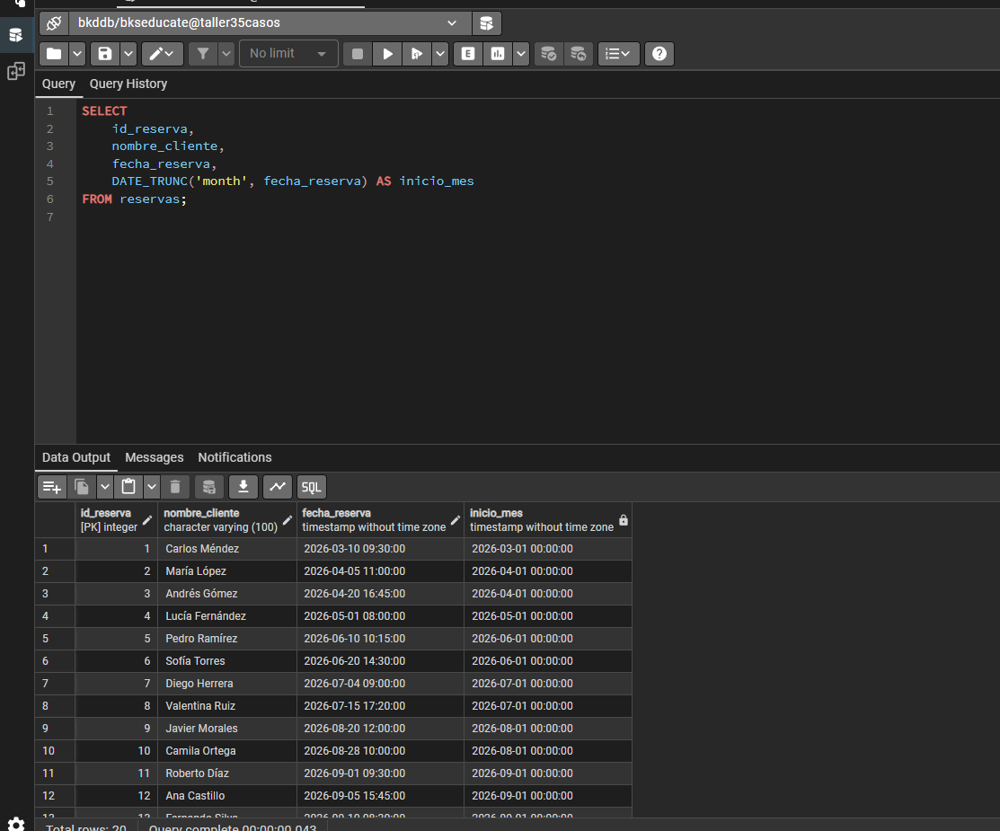

### Caso de uso 22: Calcular el ingreso total estimado por reserva

```sql
SELECT
    id_reserva,
    nombre_cliente,
    tipo_habitacion,
    tarifa_noche,
    (fecha_checkout::DATE - fecha_checkin::DATE) AS noches,
    tarifa_noche * (fecha_checkout::DATE - fecha_checkin::DATE) AS ingreso_total
FROM reservas;


-- ============================================================
```

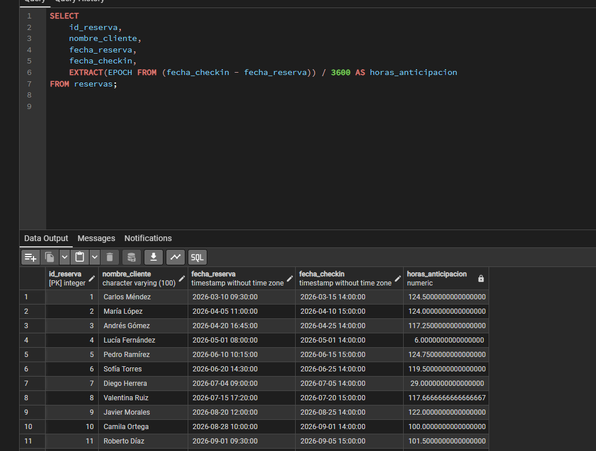

### Caso de uso 23: Truncar la fecha de reserva al inicio del mes

```sql
SELECT
    id_reserva,
    nombre_cliente,
    fecha_reserva,
    DATE_TRUNC('month', fecha_reserva) AS inicio_mes
FROM reservas;


-- ============================================================
```

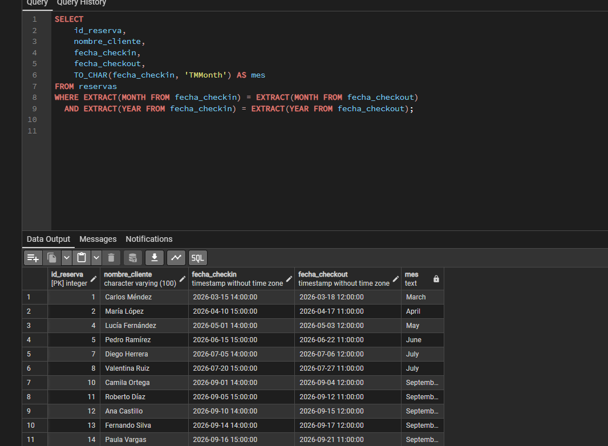

### Caso de uso 24: Diferencia en horas entre la reserva y el check-in

```sql
SELECT
    id_reserva,
    nombre_cliente,
    fecha_reserva,
    fecha_checkin,
    EXTRACT(EPOCH FROM (fecha_checkin - fecha_reserva)) / 3600 AS horas_anticipacion
FROM reservas;


-- ============================================================
```

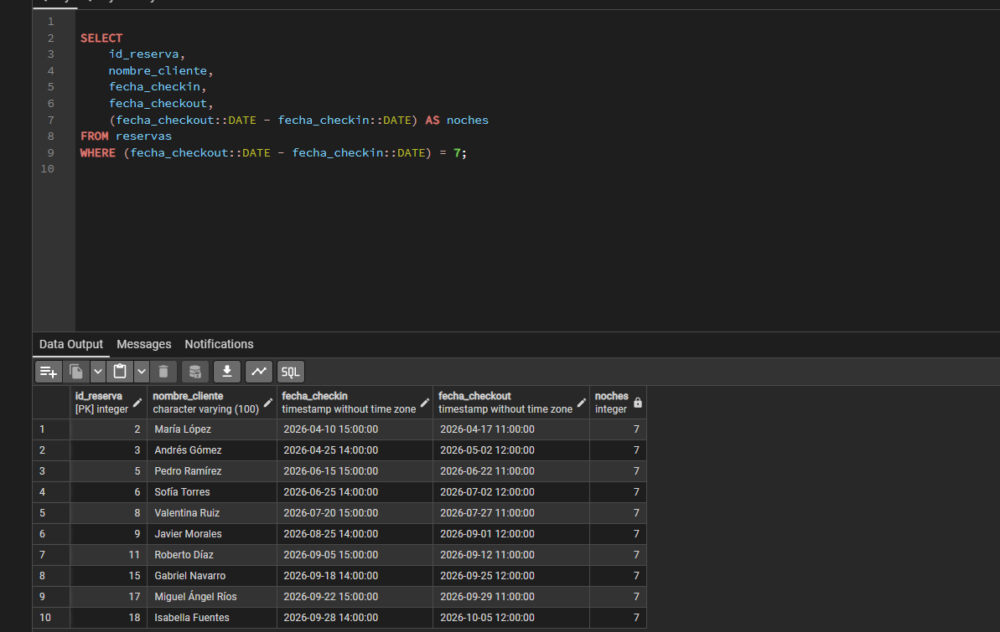

### Caso de uso 25: Reservas con check-in y checkout en el mismo mes

```sql
SELECT
    id_reserva,
    nombre_cliente,
    fecha_checkin,
    fecha_checkout,
    TO_CHAR(fecha_checkin, 'TMMonth') AS mes
FROM reservas
WHERE EXTRACT(MONTH FROM fecha_checkin) = EXTRACT(MONTH FROM fecha_checkout)
  AND EXTRACT(YEAR FROM fecha_checkin) = EXTRACT(YEAR FROM fecha_checkout);


-- ============================================================
```

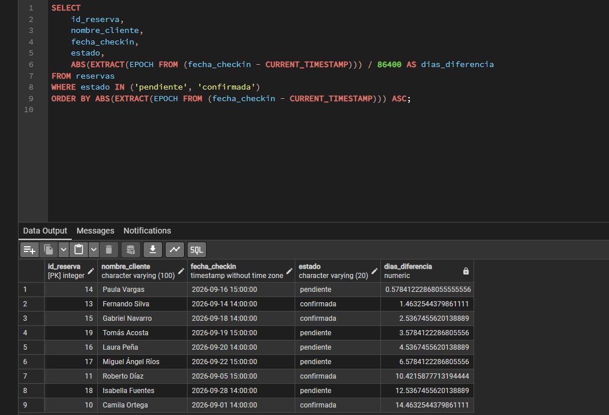

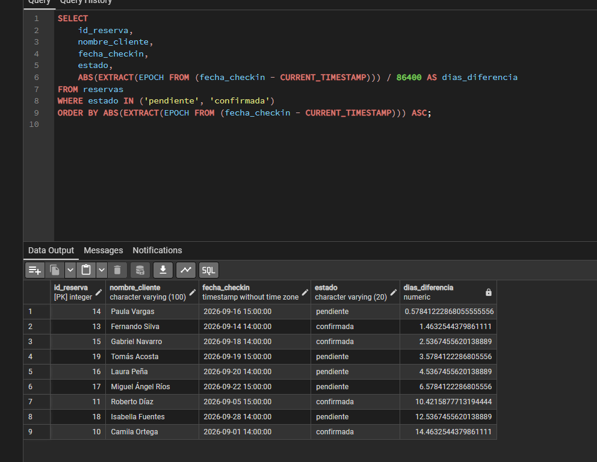

### Caso de uso 26: Reservas que duran exactamente 7 días (1 semana)

```sql
SELECT
    id_reserva,
    nombre_cliente,
    fecha_checkin,
    fecha_checkout,
    (fecha_checkout::DATE - fecha_checkin::DATE) AS noches
FROM reservas
WHERE (fecha_checkout::DATE - fecha_checkin::DATE) = 7;


-- ============================================================
```

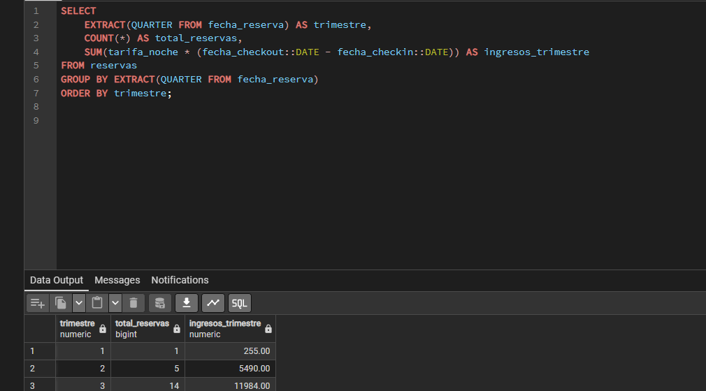

### Caso de uso 27: Listar reservas ordenadas por proximidad al check-in

```sql
SELECT
    id_reserva,
    nombre_cliente,
    fecha_checkin,
    estado,
    ABS(EXTRACT(EPOCH FROM (fecha_checkin - CURRENT_TIMESTAMP))) / 86400 AS dias_diferencia
FROM reservas
WHERE estado IN ('pendiente', 'confirmada')
ORDER BY ABS(EXTRACT(EPOCH FROM (fecha_checkin - CURRENT_TIMESTAMP))) ASC;


-- ============================================================
```

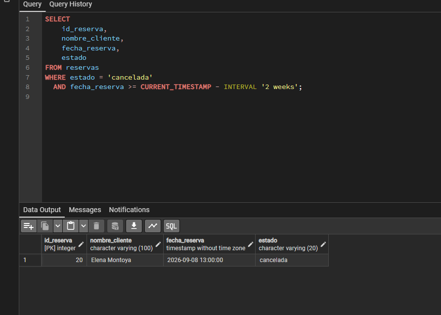

### Caso de uso 28: Promedio de noches de estadía por tipo de habitación

```sql
SELECT
    tipo_habitacion,
    ROUND(AVG(fecha_checkout::DATE - fecha_checkin::DATE), 2) AS promedio_noches
FROM reservas
GROUP BY tipo_habitacion
ORDER BY promedio_noches DESC;


-- ============================================================
```

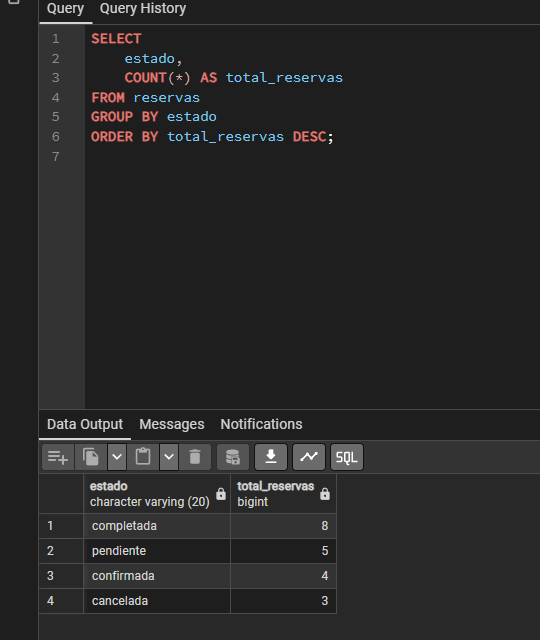

### Caso de uso 29: Reservas agrupadas por trimestre del año

```sql
SELECT
    EXTRACT(QUARTER FROM fecha_reserva) AS trimestre,
    COUNT(*) AS total_reservas,
    SUM(tarifa_noche * (fecha_checkout::DATE - fecha_checkin::DATE)) AS ingresos_trimestre
FROM reservas
GROUP BY EXTRACT(QUARTER FROM fecha_reserva)
ORDER BY trimestre;


-- ============================================================
```

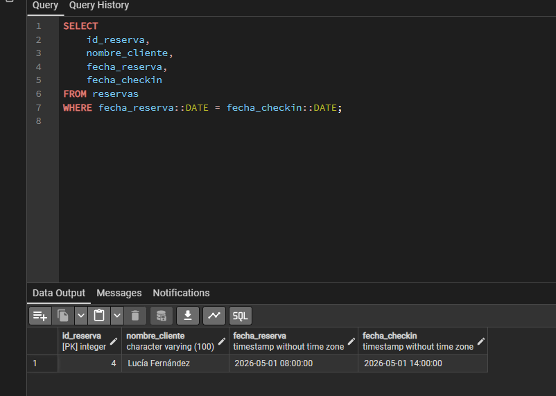

### Caso de uso 30: Reservas canceladas en las últimas 2 semanas

```sql
SELECT
    id_reserva,
    nombre_cliente,
    fecha_reserva,
    estado
FROM reservas
WHERE estado = 'cancelada'
  AND fecha_reserva >= CURRENT_TIMESTAMP - INTERVAL '2 weeks';


-- ============================================================
```

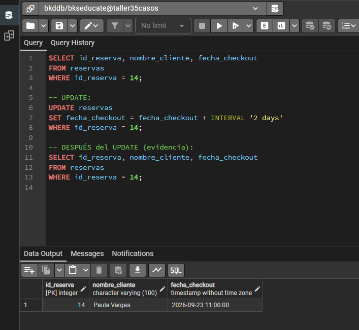

### Caso de uso 31: Contar reservas por estado

```sql
SELECT
    estado,
    COUNT(*) AS total_reservas
FROM reservas
GROUP BY estado
ORDER BY total_reservas DESC;


-- ============================================================
```

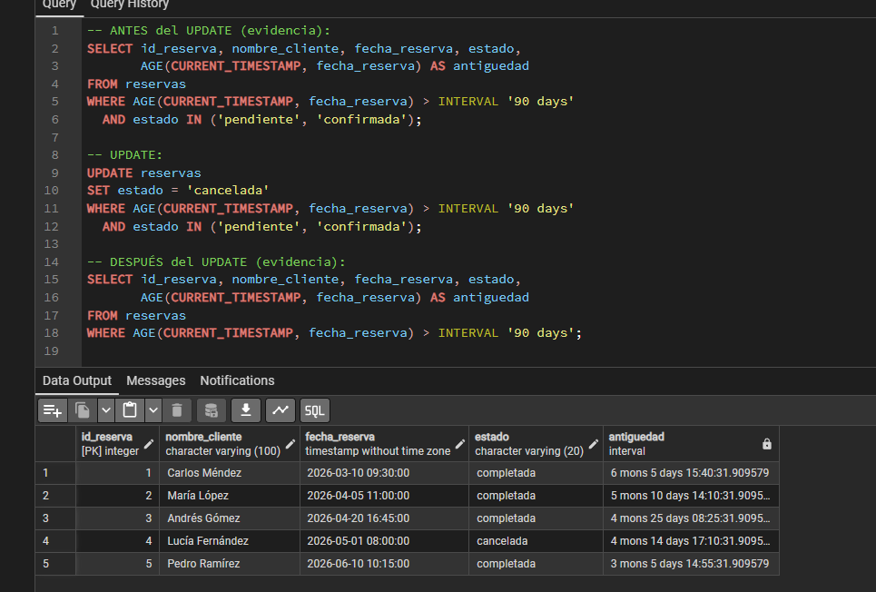

### Caso de uso 32: Reservas donde la fecha de reserva coincide

```sql
SELECT
    id_reserva,
    nombre_cliente,
    fecha_reserva,
    fecha_checkin
FROM reservas
WHERE fecha_reserva::DATE = fecha_checkin::DATE;


-- ============================================================
```

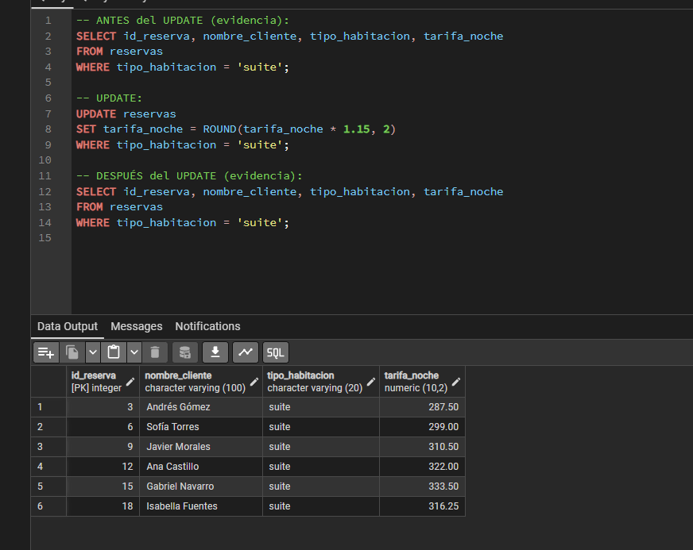

### Caso de uso 33: UPDATE — Extender el checkout sumando 2 noches

```sql
-- ANTES del UPDATE (evidencia):
SELECT id_reserva, nombre_cliente, fecha_checkout
FROM reservas
WHERE id_reserva = 14;

-- UPDATE:
UPDATE reservas
SET fecha_checkout = fecha_checkout + INTERVAL '2 days'
WHERE id_reserva = 14;

-- DESPUÉS del UPDATE (evidencia):
SELECT id_reserva, nombre_cliente, fecha_checkout
FROM reservas
WHERE id_reserva = 14;


-- ============================================================
```

*(No se encontró imagen para este caso)*

### Caso de uso 34: UPDATE — Cancelar reservas con más de 90 días

```sql
-- ANTES del UPDATE (evidencia):
SELECT id_reserva, nombre_cliente, fecha_reserva, estado,
       AGE(CURRENT_TIMESTAMP, fecha_reserva) AS antiguedad
FROM reservas
WHERE AGE(CURRENT_TIMESTAMP, fecha_reserva) > INTERVAL '90 days'
  AND estado IN ('pendiente', 'confirmada');

-- UPDATE:
UPDATE reservas
SET estado = 'cancelada'
WHERE AGE(CURRENT_TIMESTAMP, fecha_reserva) > INTERVAL '90 days'
  AND estado IN ('pendiente', 'confirmada');

-- DESPUÉS del UPDATE (evidencia):
SELECT id_reserva, nombre_cliente, fecha_reserva, estado,
       AGE(CURRENT_TIMESTAMP, fecha_reserva) AS antiguedad
FROM reservas
WHERE AGE(CURRENT_TIMESTAMP, fecha_reserva) > INTERVAL '90 days';


-- ============================================================
```

*(No se encontró imagen para este caso)*

### Caso de uso 35: UPDATE — Incrementar tarifa en 15% para suites

```sql
-- ANTES del UPDATE (evidencia):
SELECT id_reserva, nombre_cliente, tipo_habitacion, tarifa_noche
FROM reservas
WHERE tipo_habitacion = 'suite';

-- UPDATE:
UPDATE reservas
SET tarifa_noche = ROUND(tarifa_noche * 1.15, 2)
WHERE tipo_habitacion = 'suite';

-- DESPUÉS del UPDATE (evidencia):
SELECT id_reserva, nombre_cliente, tipo_habitacion, tarifa_noche
FROM reservas
WHERE tipo_habitacion = 'suite';


-- ************************************************************
-- RETO INTEGRADOR
-- ************************************************************
-- Objetivo: Generar un resumen ejecutivo por tipo de habitación
-- que combine múltiples funciones de fecha, agregaciones y cálculos.
-- ************************************************************

-- ============================================================
```

*(No se encontró imagen para este caso)*

### Reto Integrador: Resumen ejecutivo por tipo de habitación

```sql
SELECT
    tipo_habitacion,
    COUNT(*) AS total_reservas,
    COUNT(*) FILTER (WHERE estado = 'completada') AS reservas_completadas,
    COUNT(*) FILTER (WHERE estado = 'cancelada') AS reservas_canceladas,
    COUNT(*) FILTER (WHERE estado IN ('pendiente', 'confirmada')) AS reservas_activas,
    ROUND(AVG(fecha_checkout::DATE - fecha_checkin::DATE), 2) AS promedio_noches,
    MIN(fecha_checkin) AS primer_checkin,
    MAX(fecha_checkout) AS ultimo_checkout,
    SUM(
        CASE
            WHEN estado != 'cancelada'
            THEN tarifa_noche * (fecha_checkout::DATE - fecha_checkin::DATE)
            ELSE 0
        END
    ) AS ingresos_efectivos,
    ROUND(AVG(
        EXTRACT(EPOCH FROM (fecha_checkin - fecha_reserva)) / 3600
    ), 2) AS promedio_horas_anticipacion,
    TO_CHAR(
        MIN(fecha_reserva), 'DD/MM/YYYY'
    ) AS reserva_mas_antigua,
    TO_CHAR(
        MAX(fecha_reserva), 'DD/MM/YYYY'
    ) AS reserva_mas_reciente
FROM reservas
GROUP BY tipo_habitacion
ORDER BY ingresos_efectivos DESC;


-- ************************************************************
-- CASO DE USO AVANZADO — REPORTE GERENCIAL
-- ************************************************************
-- Objetivo: Construir un reporte gerencial completo usando CTEs,
-- subconsultas, funciones de ventana y todas las funciones de
-- fecha vistas en el taller.
-- ************************************************************

-- ============================================================
```

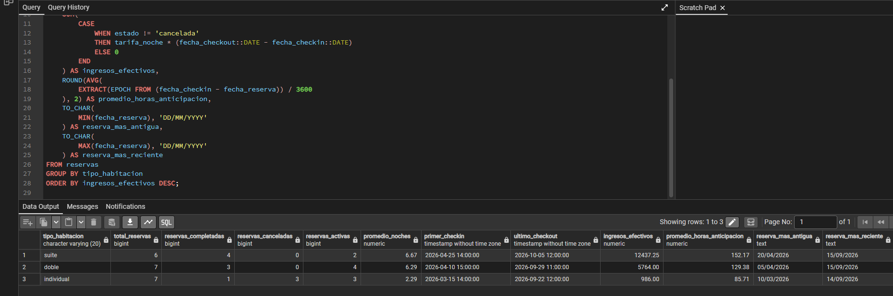

### Reporte Gerencial — Sección 1: Top 5 clientes por ingreso

```sql
WITH
metricas_reserva AS (
    SELECT
        id_reserva,
        nombre_cliente,
        tipo_habitacion,
        numero_habitacion,
        estado,
        fecha_reserva,
        fecha_checkin,
        fecha_checkout,
        tarifa_noche,
        (fecha_checkout::DATE - fecha_checkin::DATE) AS noches,
        tarifa_noche * (fecha_checkout::DATE - fecha_checkin::DATE) AS ingreso_bruto,
        EXTRACT(EPOCH FROM (fecha_checkin - fecha_reserva)) / 3600 AS horas_anticipacion,
        EXTRACT(QUARTER FROM fecha_reserva) AS trimestre,
        TO_CHAR(fecha_reserva, 'TMMonth') AS mes_reserva,
        EXTRACT(DOW FROM fecha_checkin) AS dia_semana_checkin,
        AGE(CURRENT_TIMESTAMP, fecha_reserva) AS antiguedad
    FROM reservas
),
ranking_clientes AS (
    SELECT
        nombre_cliente,
        tipo_habitacion,
        ingreso_bruto,
        RANK() OVER (
            PARTITION BY tipo_habitacion
            ORDER BY ingreso_bruto DESC
        ) AS ranking_por_tipo,
        ROW_NUMBER() OVER (
            ORDER BY ingreso_bruto DESC
        ) AS ranking_general
    FROM metricas_reserva
    WHERE estado != 'cancelada'
)
SELECT
    ranking_general,
    nombre_cliente,
    tipo_habitacion,
    ingreso_bruto,
    ranking_por_tipo
FROM ranking_clientes
WHERE ranking_general <= 5
ORDER BY ranking_general;


-- ============================================================
```

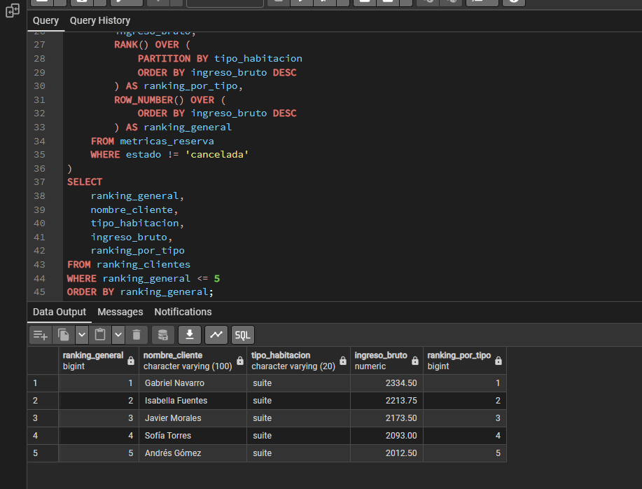

### Reporte Gerencial — Sección 2: Tendencia mensual

```sql
WITH
metricas_reserva AS (
    SELECT
        fecha_reserva,
        estado,
        (fecha_checkout::DATE - fecha_checkin::DATE) AS noches,
        tarifa_noche * (fecha_checkout::DATE - fecha_checkin::DATE) AS ingreso_bruto
    FROM reservas
),
estadisticas_mensuales AS (
    SELECT
        DATE_TRUNC('month', fecha_reserva) AS mes,
        TO_CHAR(fecha_reserva, 'YYYY - TMMonth') AS periodo,
        COUNT(*) AS reservas_mes,
        SUM(CASE WHEN estado != 'cancelada' THEN ingreso_bruto ELSE 0 END) AS ingresos_mes,
        ROUND(AVG(noches), 2) AS promedio_noches_mes,
        COUNT(*) FILTER (WHERE estado = 'cancelada') AS cancelaciones_mes,
        ROUND(
            COUNT(*) FILTER (WHERE estado = 'cancelada')::NUMERIC / COUNT(*) * 100, 2
        ) AS tasa_cancelacion
    FROM metricas_reserva
    GROUP BY DATE_TRUNC('month', fecha_reserva), TO_CHAR(fecha_reserva, 'YYYY - TMMonth')
)
SELECT
    periodo,
    reservas_mes,
    ingresos_mes,
    promedio_noches_mes,
    cancelaciones_mes,
    tasa_cancelacion || '%' AS tasa_cancelacion,
    SUM(ingresos_mes) OVER (ORDER BY mes) AS ingresos_acumulados
FROM estadisticas_mensuales
ORDER BY mes;


-- ============================================================
```

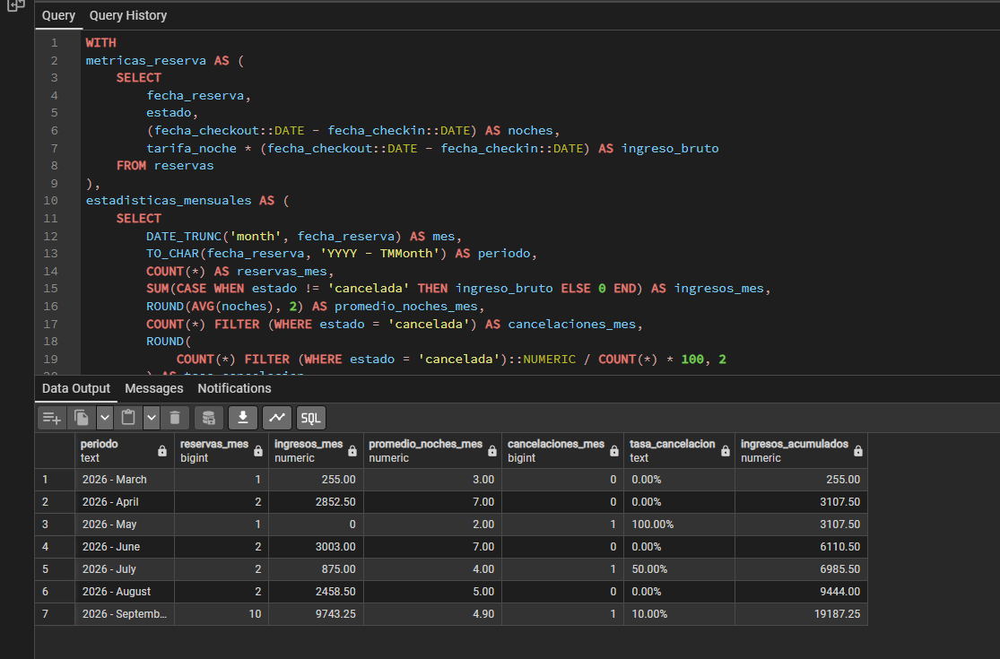

### Reporte Gerencial — Sección 3: Ocupación por día de la semana

```sql
SELECT
    CASE EXTRACT(DOW FROM fecha_checkin)
        WHEN 0 THEN 'Domingo'
        WHEN 1 THEN 'Lunes'
        WHEN 2 THEN 'Martes'
        WHEN 3 THEN 'Miércoles'
        WHEN 4 THEN 'Jueves'
        WHEN 5 THEN 'Viernes'
        WHEN 6 THEN 'Sábado'
    END AS dia_semana,
    COUNT(*) AS total_checkins,
    ROUND(AVG(fecha_checkout::DATE - fecha_checkin::DATE), 2) AS promedio_noches
FROM reservas
GROUP BY EXTRACT(DOW FROM fecha_checkin)
ORDER BY EXTRACT(DOW FROM fecha_checkin);


-- ============================================================
```

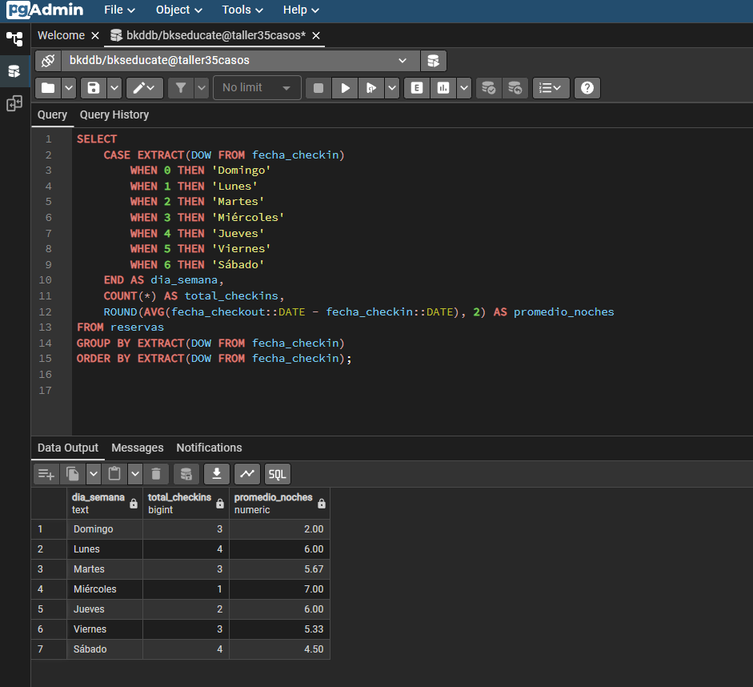

### Reporte Gerencial — Sección 4: Alertas operativas

```sql
SELECT
    id_reserva,
    nombre_cliente,
    tipo_habitacion,
    fecha_checkin,
    estado,
    CASE
        WHEN fecha_checkin BETWEEN CURRENT_TIMESTAMP AND CURRENT_TIMESTAMP + INTERVAL '3 days'
            THEN '⚠️ CHECK-IN MUY PRÓXIMO'
        WHEN fecha_checkin BETWEEN CURRENT_TIMESTAMP AND CURRENT_TIMESTAMP + INTERVAL '7 days'
            THEN '📋 CHECK-IN ESTA SEMANA'
        WHEN fecha_checkout < CURRENT_TIMESTAMP AND estado = 'confirmada'
            THEN '🔴 CHECKOUT VENCIDO SIN COMPLETAR'
        WHEN AGE(CURRENT_TIMESTAMP, fecha_reserva) > INTERVAL '60 days' AND estado = 'pendiente'
            THEN '🟡 RESERVA PENDIENTE ANTIGUA'
        ELSE '✅ SIN ALERTAS'
    END AS alerta
FROM reservas
WHERE estado IN ('pendiente', 'confirmada')
ORDER BY fecha_checkin;


-- ============================================================
-- FIN DEL SCRIPT DE CONSULTAS
-- ============================================================
```

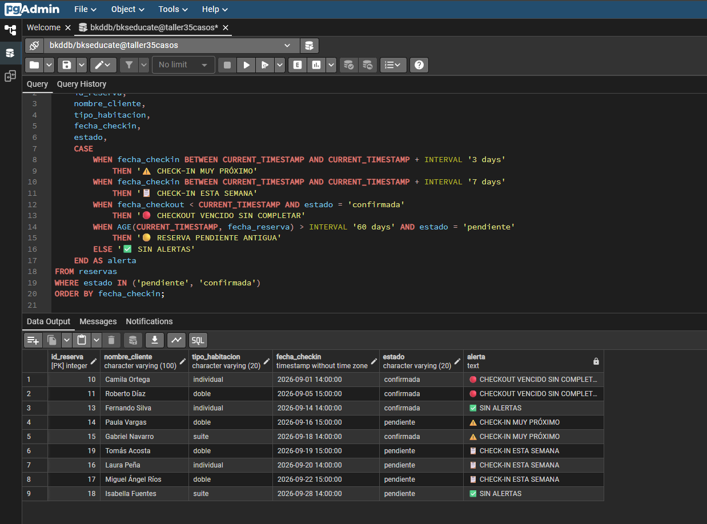

